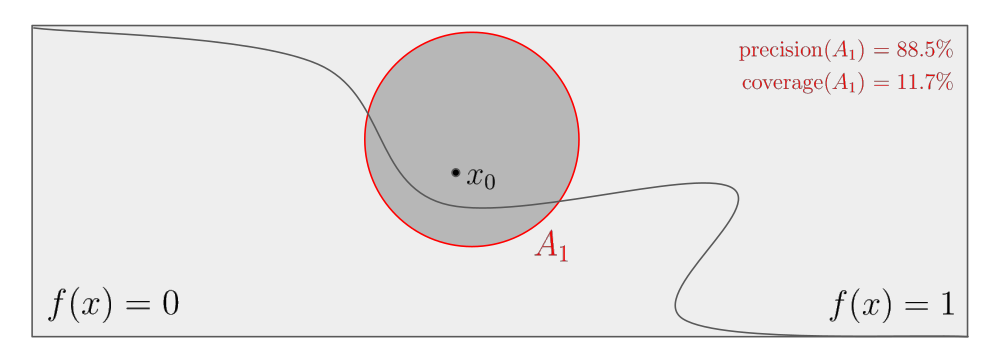
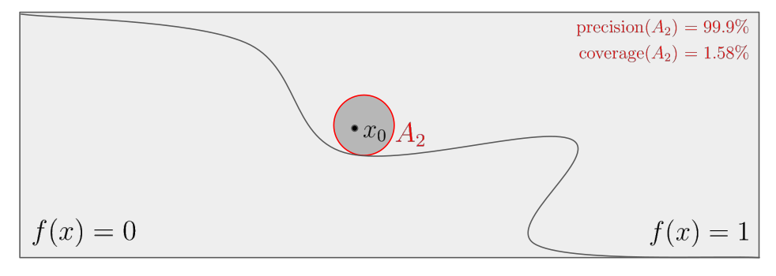
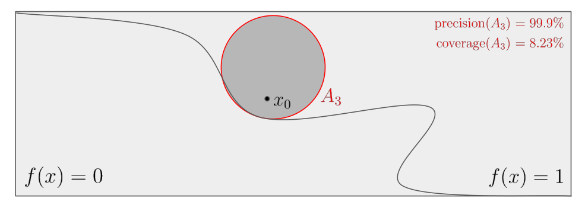
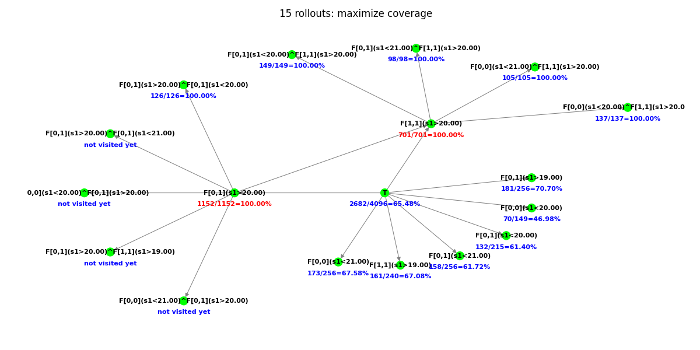

This repository implements the algorithm introduced in our paper:
- Tzu-Yi Chiu, Jérôme Le Ny, and Jean Pierre David, 
**Temporal Logic Explanations for Dynamic Decision Systems using 
Anchors and Monte Carlo Tree Search**, 
*The journal of Artificial Intelligence (AIJ)*, 
[under review] 2022

# Abstract

For many automated perception and decision tasks, state-of-the-art 
performance may be obtained by algorithms that are too complex for 
their behavior to be completely understandable or predictable by human 
users, e.g., because they employ large machine learning models.
To integrate these algorithms into safety-critical decision and control 
systems, it is particularly important to develop methods that can 
promote trust into their decisions and help explore their failure modes.

**In this article, we combine the *anchors* methodology 
[[1]](https://homes.cs.washington.edu/~marcotcr/aaai18.pdf)
with Monte Carlo Tree Search (MCTS) to provide local model-agnostic explanations 
for the behaviors of a given black-box model making decisions by 
processing time-varying input signals.**
**Our approach searches for highly descriptive explanations for these 
decisions in the form of properties of the input signals, expressed in 
Signal Temporal Logic (STL), which are highly likely to reproduce the 
observed behavior.**

To illustrate the methodology, we apply it in simulations to the 
analysis of a hybrid (continuous-discrete) control system and a 
collision avoidance system for unmanned aircraft (ACAS Xu) implemented 
by a neural network.

# Basic definitions

Let $f: X \rightarrow \lbrace 0, 1 \rbrace$ be a black-box model and 
$x_0 \in X$ be a given input instance for which we want to explain the model's 
output $f(x_0)$. 

### anchor
An anchor is defined as a rule $A_{x_0}$ verified by $x_0$ whose precision 
(see below) is above a certain threshold $\tau \in [0, 1]$.

It can be viewed as a logic formula describing via a set of rules (predicates) 
a neighborhood $A_{x_0} \subset X$ of $x_0$, such that inputs 
sampled from $A_{x_0}$ lead to the same output $f(x_0)$ with high probability. 

### precision
The precision of a rule $A$ is the probability that the black-box model's 
output is the same for a random input $z$ satisfying $A$ as for $x_0$:
$$\text{precision}(A) := \mathbb P(f(z) = f(x_0) \\, | \\, z \in A)$$

### coverage
The coverage of a rule $A$ is the probability that a random input satisfies $A$:
$$\text{coverage}(A) := \mathbb P(z \in A)$$

## Illustration

The figure below illustrates the notions of precision and coverage.
On this figure, the curved boundary separates the decision $f(x) = 1$ from the 
other $f(x) = 0$.

<p align="center">
    
    
    
</p>

Suppose that the threshold $\tau$ defining an anchor is fixed at 99%. 
Then $A_1$ is not a valid anchor because of its low
precision, but $A_2$ and $A_3$ are. Finally, $A_3$ is preferred to $A_2$ 
because of its higher coverage.

Although only the precision is involved to define *anchors*, rules that have 
broader coverage, i.e., that are satisfied by more input instances, are 
intuitively preferable. 
Essentially, an explanation of high precision approximates an accurate 
sufficient condition on the input features such that the output remains the 
same, while a larger coverage makes the explanation more general, thus 
approaching a necessary condition. 

Therefore, [[1]](https://homes.cs.washington.edu/~marcotcr/aaai18.pdf) 
proposes to maximize the *coverage* among all anchors to find 
the best explanations, i.e., among those which have sufficient precision. 
This anchor with maximized coverage allows to locally approximate the boundary 
separating the inputs leading to the specific output $f(x_0)$ from the rest.

# Thermostat: an illustrative example

We provide a simple example to illustrate the evolution of a Directed Acyclic 
Graph (DAG) built with the proposed MCTS algorithm. 
We work here over the discrete time set $t \in \lbrace 0, 1 \rbrace$. 

Consider an automated thermostat, measuring the temperature signal 
$s_1(t)$ of a room at times $t = 0$ (the reference time) and $t = 1$. 
At time $t = 1$, it switches off if at least one of the values $s_1(0)$, 
$s_1(1)$ is greater than 20&deg;C. 
**Suppose that this mechanism is unknown to us but that we can perform 
simulations of this thermostat. 
Consider a measured signal [19&deg;C, 21&deg;C]. 
We observe that the thermostat switches off at *t* = 1 for this signal, 
and we seek to provide an explanation for this behavior.**
We use first-level primitives, with the parameter $\mu$ allowed to take the values 19&deg;C, 20&deg;C, 21&deg;C. 

Starting from the trivial STL formula $\top$, we perform 15 roll-outs 
and show in the following the construction (the first snapshots) of the DAG, 
necessary to identify the next move from $\top$. 


At the end, the algorithm returns $\mathbf{F}_{[0,1]}(s_1 > 20^{\circ}\text{C})$
with its 100% empirical precision.
In words, this explanation says: 
**"the thermostat is switched off at *t* = 1 because the temperature 
is above 20&deg;C at least once in the interval $\mathbf{[0, 1]}$"**, 
which corresponds exactly in this case to how the thermostat indeed works.



# Repository organization

```
 |- main.py      - Main executable script
 |- mcts.py      - Tree object implementing MCTS steps 
 |- stl.py       - STL objects (primitives & formulas)
 |- visual.py    - Script for visualization of the tree evolution (Section 4.3) 
 |- simulator.py - Abstract class for simulators
 |
 |  **folders**
 |- simulators   - Simulators that can generate signal samples (function `simulate`)
 |- demo         - Figures and important log files
 |_ log          - Automatically generated log files
```

# Usage

The code was developped in Python 3.8 and should only require basic packages 
such as `numpy`.

In [main.py](main.py), multiple case studies (see [here](simulators/README.md) 
for details) can be run successively by uncommenting the corresponding lines:
```python
def main(log_to_file: bool = False) -> None:
    "Run algorithm in multiple case studies."
    set_logger() # log to terminal
    simulators = []
    simulators.append('thermostat')
    #simulators.append('auto_trans_alarm1')
    #simulators.append('auto_trans_alarm2')
    #simulators.append('auto_trans_alarm3')
    #simulators.append('auto_trans_alarm4')
    #simulators.append('auto_trans_alarm5')
    #simulators.append('auto_trans')
    #simulators.append('acas_xu')
    for simulator in simulators:
        if log_to_file:
            set_logger(simulator)
        run(simulator)
```

The argument `--log [-l]` logs the (intermediate & final)
results to a `log` folder:
```
python3 main.py [--log [-l]]
```

For the automated thermostat specifically, the evolution of the DAG shown above 
can be visualized with [visual.py](visual.py):
```
python3 visual.py
```

# Acknowledgements

This work was funded by [NSERC](https://www.nserc-crsng.gc.ca/index_eng.asp) 
under grant ALLRP 548464-19.

# References

[[1] T. M. Ribeiro, S. Singh, C. Guestrin, Anchors: High-precision model-agnostic explanations, AAAI.](https://homes.cs.washington.edu/~marcotcr/aaai18.pdf)
