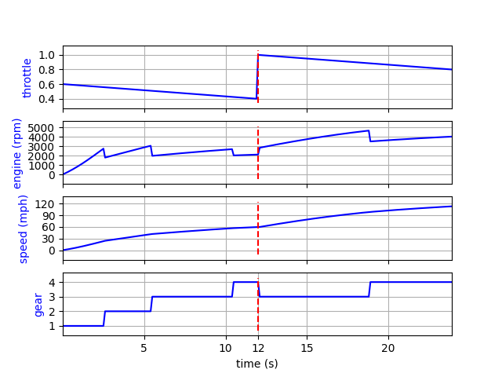
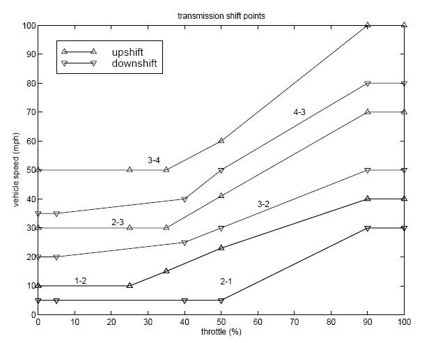
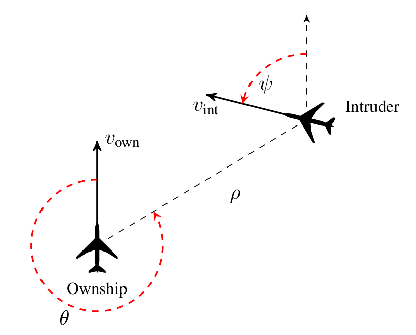
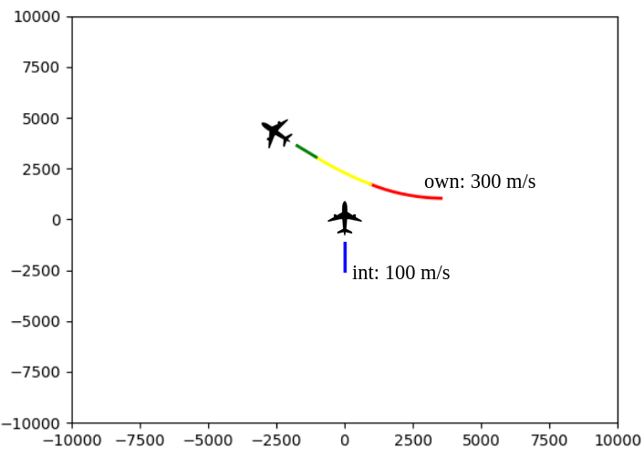

We implemented 3 simulators:
- Thermostat: an illustrative example (Section 4.3)
- Automotive automatic transmission system (Section 5)
- ACAS Xu (Section 6)

For each case study, please refer to the corresponding section of the 
paper for more context.

# Thermostat: an illustrative example (Section 4.3)

See `thermostat` defined in [main.py](../main.py) and the 
illustrative example [here](../README.md).

# Automotive automatic transmission system (Section 5)

## Explaining an STL-based monitoring system (Section 5.2)

To evaluate and validate the proposed algorithm, we consider five of 
the requirements on an automotive automatic transmission system
(`espd` for engine speed & `vspd` for vehicle speed):
- `G[0,10](espd<4750)`
- `G[0,20](vspd<120)`
- `G[0,30](espd<3000) => G[0,4](vspd<35)`
- `G[0,30](espd<3000) => G[0,8](vspd<50)`
- `G[0,30](espd<3000) => G[0,20](vspd<65)`

Suppose that a monitoring system triggers an alarm when a requirement is 
violated. 
We consider each of these monitoring systems as a black-box model and 
aim to *recover* the formulas defining them.
In other words, we try to explain 
**why the alarm has been triggered** just by observing a signal.

See `auto_trans_alarm1` to `auto_trans_alarm5` defined in 
[simulators](../simulators) and [main.py](../main.py).

## Explaining the transmission during a passing maneuver (Section 5.3)

We now focus on a scenario where the vehicle is performing a passing 
maneuver. 
Initially the vehicle is accelerating with the throttle linearly 
decreasing from 60% to 40%, up-shifting the vehicle to the 4th gear. 
At the 12th second, the throttle is suddenly pressed to 100%,
making the transmission system down-shift to the 3rd gear.
The shifting schedule of the transmission system is shown below but 
assumed unknown. 

    
    

We attempt to find automatically a (local) rule explaining 
**why the system engaged the 3rd gear at the 12th second**, 
by analyzing the throttle opening, the engine speed and the 
vehicle speed in the previous seconds, using PtSTL (Past Time STL).

See [auto_trans.py](../simulators/auto_trans.py) and 
`auto_trans` defined in [main.py](../main.py).

# ACAS Xu

## Explaining an advisory change (Section 6)

ACAS Xu is a system implementing the decision making logic of an ACAS 
(Airborne Collision Avoidance System) specifically for unmanned aerial 
vehicles. 
It uses dynamic programming to provide maneuver guidance maintaining 
horizontal and vertical separation between two aircraft.

In our scenario, the system issued an SRT (Strong Right Turn) advisory 
for the ownship from the very beginning during 10 seconds, and switched 
to WRT (Weak Right Turn) and finally COC (Clear Of Conflict) when the 
two aircraft were no longer in danger of colliding with each other. 

    
    

We attempt to find an explanation, expressed in PtSTL, for 
**why the advisory switched from SRT to WRT at the 10th second.**

See [acas_xu.py](../simulators/acas_xu.py) and 
`acas_xu` defined in [main.py](../main.py).
